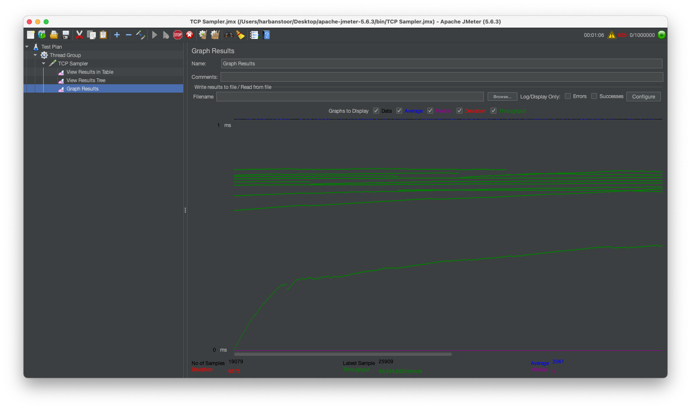

# Server Performance Comparison

## Overview
This project, "server_performance_comparison," aims to compare the performance of three types of Java servers: Single Threaded, Multi-Threaded, and ThreadPool. The comparison is based on sending 1 million requests through JMeter to each type of server and measuring their throughput. It was observed that the ThreadPool implementation achieved the highest throughput, followed by Multi-Threaded, and then Single Threaded.

## Server Types
1. **Single Threaded Server**: A server implementation where each incoming request is processed sequentially by a single thread.
2. **Multi-Threaded Server**: A server implementation where incoming requests are processed concurrently by multiple threads.
3. **ThreadPool Server**: A server implementation utilizing a thread pool to process incoming requests concurrently. A fixed-size thread pool with 100 threads is used in this project.

## JMeter
[JMeter](https://jmeter.apache.org/) is an Apache project that can be used as a load testing tool for analyzing and measuring the performance of servers. In this project, JMeter was utilized to simulate the load on each server type by sending 1 million requests.


## Performance Comparison
- Throughput measurements were conducted for all three types of servers.

- The ThreadPool server exhibited the highest throughput, followed by the Multi-Threaded server, and then the Single Threaded server.

- All servers were configured with a timeout of 10 seconds for handling requests.




## Components
The project consists of the following components:
- **Server Classes**: Separate classes are implemented for each type of server, namely SingleThreadedServer, MultiThreadedServer, and ThreadPoolServer.


- **Client Classes**: Corresponding client classes are created for each type of server to simulate the sending of requests, namely SingleThreadedClient, MultiThreadedClient, and ThreadPoolClient.


## Usage
1. **Clone the Repository:**
   Open a terminal or command prompt and navigate to the directory where you want to clone the project.
   Run the following command to clone the repository:
   ```
   git clone https://github.com/harbanssinghtoor/server_performance_comparison
   ```

2. **Open IntelliJ IDEA:**
   Open IntelliJ IDEA on your local machine.

3. **Open the Project:**
   Click on "Open or Import" in the IntelliJ IDEA welcome screen.
   Navigate to the directory where you cloned the repository.
   Select the directory and click "Open" to open the project in IntelliJ IDEA.

4. **Configure JDK (if necessary):**
   If the project requires a specific JDK version, configure it in IntelliJ IDEA:
   - Go to `File` > `Project Structure`.
   - Under `Project`, select the appropriate JDK version from the dropdown menu.

5. **Import Project Dependencies:**
   If the project uses Maven or Gradle for dependency management, IntelliJ IDEA will automatically import the dependencies when you open the project.
6. Run the desired server implementation (SingleThreadedServer, MultiThreadedServer, or ThreadPoolServer) using the appropriate client (SingleThreadedClient, MultiThreadedClient, or ThreadPoolClient).

7. Install JMeter on your system if not already installed.

8. Add the desired number of threads and ramp-up period in the JMeter test plan to simulate the desired load on the servers.

9. Configure JMeter to send requests to the server implementations under test.

10. Execute the [JMeter](https://github.com/harbanssinghtoor/server_performance_comparison?tab=readme-ov-file#jmeter) test plan.

11. Analyze the graphical and tabular representations provided by JMeter to understand the transaction of requests and identify any performance bottlenecks.

## Additional Notes
- This project serves as a demonstration of performance variance between different server implementations in Java.
- Further optimizations and enhancements can be explored, such as adjusting thread pool sizes, tuning timeout values, or implementing asynchronous request handling.

## Contributors

Feel free to contribute to this project by forking and creating pull requests.

## License

This project is licensed under the MIT License, allowing for open collaboration and usage.